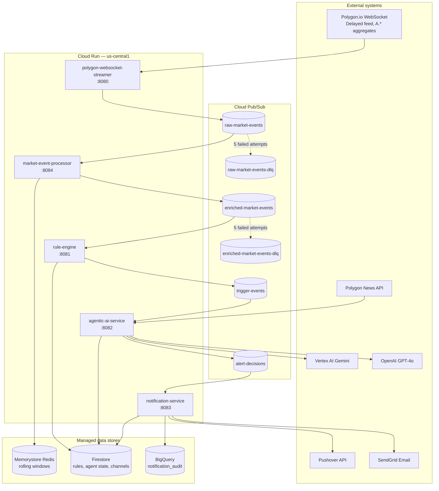
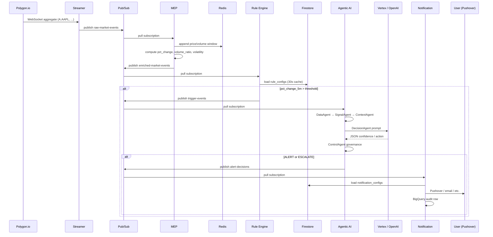
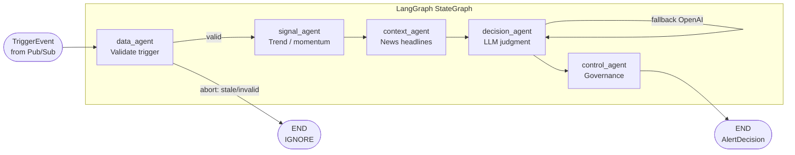
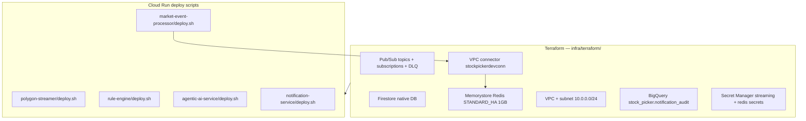
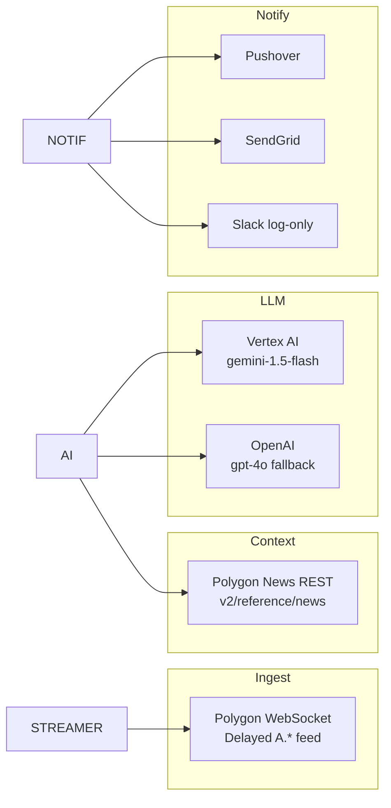
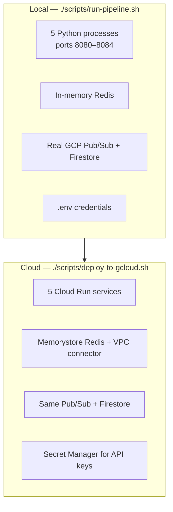

# Stock Picker — System Architecture

This document describes the Phase 2 Stock Picker pipeline: a GCP-native, event-driven system that ingests market data from Polygon.io, evaluates rules, validates alerts with an agentic LLM workflow, and delivers notifications.

**GCP project (current deployment):** `stockadvisor-498000`  
**Region:** `us-central1`

---

## Table of contents

1. [Executive summary](#1-executive-summary)
2. [High-level architecture](#2-high-level-architecture)
3. [End-to-end data flow](#3-end-to-end-data-flow)
4. [Service components](#4-service-components)
5. [Agentic AI workflow](#5-agentic-ai-workflow)
6. [Infrastructure layer](#6-infrastructure-layer)
7. [Message contracts](#7-message-contracts)
8. [External integrations](#8-external-integrations)
9. [Local vs cloud deployment](#9-local-vs-cloud-deployment)
10. [Reliability and failure handling](#10-reliability-and-failure-handling)
11. [Security and secrets](#11-security-and-secrets)
12. [Operational scripts](#12-operational-scripts)

---

## 1. Executive summary

Stock Picker is a **five-service microservice pipeline** connected by **Google Cloud Pub/Sub**. Each service is a Python application packaged as a Docker image and deployed to **Cloud Run**.

| Stage | Service | Responsibility |
|-------|---------|----------------|
| Ingest | Polygon WebSocket Streamer | Real-time market ticks → Pub/Sub |
| Enrich | Market Event Processor | Rolling metrics (price change, volume, volatility) |
| Detect | Rule Engine | Threshold rules → trigger events |
| Validate | Agentic AI Service | LangGraph + LLM governance → alert decisions |
| Deliver | Notification Service | Multi-channel fan-out + audit log |

**Design principles:**

- **Async decoupling** — Pub/Sub buffers load between stages; slow LLM calls do not block the WebSocket.
- **Independent scaling** — Each Cloud Run service scales on its own subscription backlog.
- **Configurable rules** — Rule thresholds live in Firestore, not code.
- **Human-grade alerts** — LLM validates triggers before notification; confidence gates and cooldowns reduce noise.

---

## 2. High-level architecture



---

## 3. End-to-end data flow



**Typical latency profile:**

| Segment | Expected duration |
|---------|-------------------|
| Streamer → MEP | Sub-second (Pub/Sub + Redis write) |
| MEP → Rule Engine | Sub-second |
| Rule Engine → Agentic AI | Only when rule fires (infrequent) |
| Agentic AI (LLM path) | 2–15s (30s timeout cap) |
| Notification | 1–3s per channel |

---

## 4. Service components

### 4.1 Polygon WebSocket Streamer

**Path:** `services/polygon-streamer/`  
**Cloud Run:** `polygon-websocket-streamer`  
**Port:** 8080

#### Purpose

Maintains a **single persistent WebSocket** to Polygon.io and publishes each parsed market event to Pub/Sub. This is the only service that talks to Polygon in real time.

#### Key modules

| Module | File | Role |
|--------|------|------|
| Stream listener | `stream_listener.py` | WebSocket lifecycle, reconnect, subscription management |
| Pub/Sub publisher | `pubsub_publisher.py` | JSON envelope publish with retries |
| Admin HTTP | `admin.py` | `/health`, `/symbols` |
| Single instance lock | `single_instance.py` | File lock — one WebSocket per API key |
| Models | `models.py` | `MarketEventMessage` schema |

#### Polygon configuration

- **Feed:** `Delayed` (default) — matches basic Polygon plans
- **Subscriptions:** `A.{symbol}` aggregate bars only (not `T.*` trades)
- **Symbols:** Comma-separated watchlist from `WATCHED_SYMBOLS` (e.g. top 20 S&P 500)
- **Scaling:** `min-instances=1`, `max-instances=1` — enforces one connection

#### Inputs / outputs

```
IN:  Polygon WebSocket (EquityAgg messages)
OUT: Pub/Sub topic raw-market-events
```

#### Health response

```json
{"status": "ok", "websocket": "connected"}
```

Returns `503` when disconnected (includes `disconnected_seconds`).

---

### 4.2 Market Event Processor (MEP)

**Path:** `services/market-event-processor/`  
**Cloud Run:** `market-event-processor`  
**Port:** 8084 (local pipeline)

#### Purpose

Consumes raw market events and **enriches** them with rolling-window metrics stored in Redis (or in-memory locally). Every enriched event is republished downstream — rules operate on computed features, not raw ticks alone.

#### Key modules

| Module | File | Role |
|--------|------|------|
| Consumer | `consumer.py` | Pub/Sub pull, ack/nack |
| Metrics calculator | `metrics_calculator.py` | pct change, volume ratio, volatility |
| Window store | `window_store.py` | Redis-backed price/volume history per symbol |
| Enriched publisher | `enriched_publisher.py` | Publish to enriched-market-events |
| Admin | `admin.py` | Health with Redis status and message counts |

#### Computed metrics

| Field | Description |
|-------|-------------|
| `pct_change_1m` | Price change vs 1-minute-ago reference |
| `pct_change_5m` | Price change vs 5-minute-ago reference |
| `avg_volume_20` | Rolling average volume (20 events) |
| `volume_ratio` | Current volume / avg_volume_20 |
| `volatility_score` | Normalized std-dev of recent prices |

#### Storage

- **Cloud:** Memorystore Redis via VPC connector `stockpickerdevconn`
- **Local:** In-memory store when `REDIS_USE_MEMORY=1` or `REDIS_HOST` unset

Redis keys follow pattern `mep:{symbol}:*`.

#### Inputs / outputs

```
IN:  subscription market-event-processor-raw-market-events
OUT: topic enriched-market-events
```

---

### 4.3 Rule Engine

**Path:** `services/rule-engine/`  
**Cloud Run:** `rule-engine`  
**Port:** 8081

#### Purpose

Evaluates **deterministic threshold rules** against enriched events. When a rule fires, publishes a `TriggerEvent` for the agentic AI layer to validate.

#### Key modules

| Module | File | Role |
|--------|------|------|
| Consumer | `consumer.py` | Pull enriched events |
| Rule config loader | `rule_config_loader.py` | Firestore `rule_configs` with 30s TTL cache |
| Rules | `rules.py` | Rule evaluation logic |
| Trigger publisher | `trigger_publisher.py` | Publish to trigger-events |
| Admin | `admin.py` | `/health`, `/rules` |

#### Active rules (current code)

| Rule | Condition | Default threshold (Firestore) |
|------|-----------|-------------------------------|
| `PRICE_SPIKE_5M` | `pct_change_5m > threshold` | 0.5% |

`VOLUME_SPIKE` has been removed from code and Firestore seed.

#### Rule configuration

Stored in Firestore collection `rule_configs/{rule_name}`:

```json
{
  "rule_name": "PRICE_SPIKE_5M",
  "enabled": true,
  "threshold": 0.5,
  "symbols": ["*"]
}
```

Changes propagate within 30 seconds (config cache TTL).

#### Inputs / outputs

```
IN:  subscription rule-engine-enriched-market-events
     Firestore rule_configs
OUT: topic trigger-events (on rule fire only)
```

---

### 4.4 Agentic AI Service

**Path:** `services/agentic-ai-service/`  
**Cloud Run:** `agentic-ai-service`  
**Port:** 8082

#### Purpose

Receives rule triggers and runs a **five-agent LangGraph workflow** to decide whether the trigger deserves a human alert. Uses LLM reasoning plus programmatic governance (confidence, cooldown, escalation).

#### Key modules

| Module | File | Role |
|--------|------|------|
| Consumer | `consumer.py` | Pull trigger-events |
| Orchestrator | `orchestrator.py` | Idempotency, 30s timeout, metrics |
| Graph | `graph.py` | LangGraph StateGraph definition |
| Agents | `agents/*.py` | Data, Signal, Context, Decision, Control |
| LLM router | `llm/router.py` | Vertex primary, OpenAI fallback |
| Publisher | `publisher.py` | Publish ALERT/ESCALATE to alert-decisions |
| Idempotency | `idempotency.py` | Firestore agent_state deduplication |
| Governance | `governance/*.py` | Thresholds, cooldown store |

#### Inputs / outputs

```
IN:  subscription agentic-ai-trigger-events
     Firestore agent_state (idempotency + cooldown)
     Polygon News API (context)
     Vertex AI / OpenAI (decision)
OUT: topic alert-decisions (ALERT and ESCALATE only)
```

See [Section 5](#5-agentic-ai-workflow) for the agent graph detail.

---

### 4.5 Notification Service

**Path:** `services/notification-service/`  
**Cloud Run:** `notification-service`  
**Port:** 8083

#### Purpose

Consumes approved alert decisions and **fans out** to configured notification channels. Records every delivery attempt in BigQuery for audit.

#### Key modules

| Module | File | Role |
|--------|------|------|
| Consumer | `consumer.py` | Pull alert-decisions |
| Router | `router.py` | Per-channel routing rules |
| Config store | `config_store.py` | Firestore notification_configs |
| Dispatcher | `dispatcher.py` | Parallel channel dispatch |
| Adapters | `*_adapter.py` | Pushover, SendGrid, Slack, Teams, Twilio |
| Audit logger | `audit_logger.py` | BigQuery notification_audit |
| Channel API | `channel_api.py` | Connect/disconnect/test channels |

#### Supported channels

| Channel | Status | Credentials |
|---------|--------|-------------|
| **Pushover** | Primary (production) | `PUSHOVER_APP_TOKEN`, `PUSHOVER_USER_KEY` |
| Email (SendGrid) | Optional | `SENDGRID_API_KEY`, `ALERT_TO_EMAIL` |
| Slack | Log-only (HTTP disabled) | `SLACK_BOT_TOKEN` |
| Teams | Webhook | Via channel API |
| Twilio | SMS/WhatsApp | Via channel API |

#### Routing rules

Each channel in Firestore can filter by:

- `symbols`: ticker list or `*`
- `actions`: `ALERT`, `ESCALATE`

#### Inputs / outputs

```
IN:  subscription notification-alert-decisions
     Firestore notification_configs/default
OUT: External APIs (Pushover, SendGrid, …)
     BigQuery stock_picker.notification_audit
```

---

## 5. Agentic AI workflow



### Agent responsibilities

| Agent | LLM? | Function |
|-------|------|----------|
| **DataAgent** | No | Validates symbol, rule name, freshness (< 10s). Builds `market_snapshot`. Aborts stale triggers. |
| **SignalAgent** | No | Heuristic `trend` (up/down/sideways), `momentum_score` (0–1), `support_proximity` label. |
| **ContextAgent** | No | Fetches recent news headlines from Polygon News API. Graceful fallback if unavailable. |
| **DecisionAgent** | **Yes** | Builds structured prompt; calls LLM; parses JSON `{ confidence, reason, action_candidate }`. |
| **ControlAgent** | No | Applies confidence threshold, per-symbol cooldown, escalation rules. Produces final `AlertDecision`. |

### LLM call path

```
decision_agent.py
  → build_decision_prompt()     # services/agentic-ai-service/src/agentic_ai/llm/prompt.py
  → LLMRouter.complete()
      → VertexGeminiClient      # gemini-1.5-flash, JSON mode, temperature 0.2
      → OpenAIChatClient        # gpt-4o fallback, response_format json_object
  → parse_raw_decision_response()
  → control_agent.apply_governance()
```

### Governance parameters

| Parameter | Default | Test mode (.env) |
|-----------|---------|------------------|
| `CONFIDENCE_THRESHOLD` | 0.70 | 0.01 |
| `ESCALATION_THRESHOLD` | 0.90 | 0.99 |
| `COOLDOWN_WINDOW_MINUTES` | 10 | 1 |
| `AGENTIC_TEST_MODE` | off | 1 (bypasses LLM) |

### Orchestration safeguards

- **Idempotency:** Duplicate `event_id` returns cached decision from Firestore
- **Timeout:** 30s workflow cap → IGNORE on timeout
- **Concurrency:** Up to 5 parallel workflows (`MAX_CONCURRENT_WORKFLOWS`)

---

## 6. Infrastructure layer



### Pub/Sub topology

| Topic | Publisher | Subscriber(s) | DLQ |
|-------|-----------|---------------|-----|
| `raw-market-events` | polygon-streamer | `market-event-processor-raw-market-events` | `raw-market-events-dlq` |
| `enriched-market-events` | market-event-processor | `rule-engine-enriched-market-events` | `enriched-market-events-dlq` |
| `trigger-events` | rule-engine | `agentic-ai-trigger-events` | — |
| `alert-decisions` | agentic-ai-service | `notification-alert-decisions` | — |

DLQ monitor subscriptions: `raw-market-events-dlq-monitor`, `enriched-market-events-dlq-monitor`.

### Firestore collections

| Collection | Purpose |
|------------|---------|
| `rule_configs/{rule_name}` | Rule thresholds, enabled flag, symbol filter |
| `notification_configs/default` | Channel credentials, routing rules, status |
| `agent_state/{event_id}` | Workflow idempotency, cooldown timestamps |

### Cloud Run scaling (deploy defaults)

| Service | min | max | Notes |
|---------|-----|-----|-------|
| polygon-streamer | 1 | 1 | Single WebSocket per API key |
| market-event-processor | 1 | 3 | VPC connector for Redis |
| rule-engine | 1 | 3 | |
| agentic-ai-service | 1 | 3 | LLM-bound |
| notification-service | 0 | 5 | Scale to zero when idle |

---

## 7. Message contracts

All pipeline messages share a **JSON envelope** (`schema_version: "1.0"`):

```json
{
  "message_id": "550e8400-e29b-41d4-a716-446655440000",
  "source_container": "polygon-websocket-streamer",
  "topic": "raw-market-events",
  "published_at": "2026-06-01T17:27:23.738Z",
  "schema_version": "1.0",
  "payload": { }
}
```

### Payload schemas by stage

#### Raw — `MarketEventMessage`

```json
{
  "symbol": "AAPL",
  "event_type": "aggregate",
  "price": 198.42,
  "volume": 12500,
  "timestamp_ns": 1717264043000000000,
  "raw_payload": { }
}
```

**Source:** `services/polygon-streamer/src/polygon_streamer/models.py`

#### Enriched — `EnrichedMarketEvent`

Extends raw fields with:

```json
{
  "pct_change_1m": 0.12,
  "pct_change_5m": 0.58,
  "avg_volume_20": 9800.0,
  "volume_ratio": 1.28,
  "volatility_score": 0.15
}
```

**Source:** `services/market-event-processor/src/market_event_processor/models.py`

#### Trigger — `TriggerEvent`

```json
{
  "event_id": "uuid",
  "symbol": "AAPL",
  "rule_name": "PRICE_SPIKE_5M",
  "triggered_value": 0.62,
  "threshold_value": 0.5,
  "enriched_event": { },
  "fired_at": "2026-06-01T17:30:00Z"
}
```

**Source:** `services/rule-engine/src/rule_engine/models.py`

#### Alert decision — `AlertDecision`

```json
{
  "event_id": "uuid",
  "symbol": "AAPL",
  "signal": "PRICE_SPIKE_5M",
  "confidence": 0.85,
  "reason": "5-minute price spike with elevated momentum…",
  "action": "ALERT",
  "context_summary": "Recent headlines: …",
  "decided_at": "2026-06-01T17:30:05Z",
  "measured_magnitude": 0.62
}
```

**Actions:** `ALERT` | `ESCALATE` | `IGNORE`  
**Source:** `services/agentic-ai-service/src/agentic_ai/models.py`

---

## 8. External integrations



| Integration | Protocol | Used by | Auth |
|-------------|----------|---------|------|
| Polygon WebSocket | WSS | polygon-streamer | API key (Secret Manager) |
| Polygon News | HTTPS REST | agentic-ai ContextAgent | Same API key |
| Vertex AI Gemini | GCP SDK | agentic-ai DecisionAgent | Application Default Credentials |
| OpenAI | HTTPS API | agentic-ai DecisionAgent | Secret Manager `openai-api-key` |
| Pushover | HTTPS POST | notification-service | Env + Firestore creds |
| SendGrid | HTTPS API | notification-service | Env |
| BigQuery | GCP SDK | notification-service audit | Service account |

---

## 9. Local vs cloud deployment



| Aspect | Local | Cloud |
|--------|-------|-------|
| Start command | `./scripts/run-pipeline.sh` | `./scripts/deploy-to-gcloud.sh` |
| Polygon streamer | File lock at `/tmp/polygon-streamer.lock` | Cloud Run `max-instances=1` |
| Redis | In-memory (`REDIS_USE_MEMORY=1`) | Memorystore `10.116.0.4` via VPC |
| Logs | `.logs/pipeline/*.log` | Cloud Logging |
| Event logging | `POLYGON_LOG_EVENTS=1` in `.env` | Not enabled by default |
| **Conflict** | Do not run local streamer while cloud streamer is up — same Polygon API key causes 1008 disconnect |

### Port map (local)

| Service | Port |
|---------|------|
| polygon-streamer | 8080 |
| rule-engine | 8081 |
| agentic-ai | 8082 |
| notification | 8083 |
| market-event-processor | 8084 |

---

## 10. Reliability and failure handling

### Pub/Sub acknowledgment model

Each consumer **acks** after successful processing. Malformed messages are acked to avoid poison-loop. Processing errors may nack for retry.

### Dead-letter queues

Subscriptions on raw and enriched topics redirect to DLQ after **5 failed delivery attempts**:

```
market-event-processor-raw-market-events  →  raw-market-events-dlq
rule-engine-enriched-market-events        →  enriched-market-events-dlq
```

Monitor via pull subscriptions `*-dlq-monitor`.

### WebSocket resilience (polygon-streamer)

- Exponential backoff reconnect
- Policy violation (1008) detection — indicates duplicate API key usage
- `STREAM_UNAVAILABLE` error log after prolonged disconnect
- Health endpoint reflects live connection state

### Agentic AI failure modes

| Failure | Behavior |
|---------|----------|
| LLM unavailable | `IGNORE` with reason "LLM unavailable" |
| JSON parse error | `IGNORE` with reason "LLM response parsing failed" |
| Workflow timeout (30s) | `IGNORE`, outcome cached in Firestore |
| Duplicate event_id | Return cached prior decision |
| Below confidence threshold | `IGNORE` by ControlAgent |
| Cooldown active | `IGNORE` by ControlAgent |

### Notification resilience

- Channels dispatch in parallel (`asyncio.gather`)
- One channel failure does not block others
- 3 consecutive failures → channel status `error`
- All attempts logged to BigQuery `notification_audit`

---

## 11. Security and secrets

| Secret | Storage | Consumers |
|--------|---------|-----------|
| `polygon-api-key` | Secret Manager | polygon-streamer |
| `openai-api-key` | Secret Manager | agentic-ai-service |
| `pushover-app-token` | Secret Manager | notification-service |
| `pushover-user-key` | Secret Manager | notification-service |
| Pushover creds | Firestore (encrypted path via config) | notification-service |
| Streaming pipeline config | Secret Manager JSON | Deploy scripts |

Cloud Run services use the default compute service account with `secretAccessor` granted by `scripts/grant-cloud-run-secrets.sh`.

**Network isolation:** Redis is private — only reachable via VPC connector from market-event-processor.

---

## 12. Operational scripts

| Script | Purpose |
|--------|---------|
| `scripts/run-pipeline.sh` | Start all 5 services locally; seed Firestore; enable Pushover |
| `scripts/stop-pipeline.sh` | Kill local pipeline processes |
| `scripts/deploy-to-gcloud.sh` | Build + deploy all Cloud Run services |
| `scripts/undeploy-from-gcloud.sh` | Remove Cloud Run services |
| `scripts/configure-business-run.sh` | Seed Firestore rules + Pushover channel |
| `infra/scripts/provision.sh` | Terraform apply + Firestore seed + `streaming.env` |
| `infra/scripts/seed_firestore.py` | Rule configs, notification config, collection placeholders |

### Deploy order

```
1. grant-cloud-run-secrets.sh
2. configure-business-run.sh (Firestore + Pushover)
3. polygon-streamer
4. market-event-processor (requires REDIS_HOST)
5. rule-engine
6. agentic-ai-service
7. notification-service
```

---

## Appendix: Phase 1 POC (legacy)

Before Phase 2, a single-process POC existed:

```
polygon_ws_poc.py  →  rule_engine.py (in-process)  →  SMTP email
```

Phase 2 replaced direct function calls with Pub/Sub and split responsibilities into five Cloud Run services. The root `rule_engine.py` remains as a reference implementation.

---

## Related documentation

| Document | Path |
|----------|------|
| Project overview | `README.md` |
| Infrastructure provisioning | `infra/README.md` |
| Polygon streamer | `services/polygon-streamer/README.md` |
| Market event processor | `services/market-event-processor/README.md` |
| Rule engine | `services/rule-engine/README.md` |
| Agentic AI | `services/agentic-ai-service/README.md` |
| Notification | `services/notification-service/README.md` |
